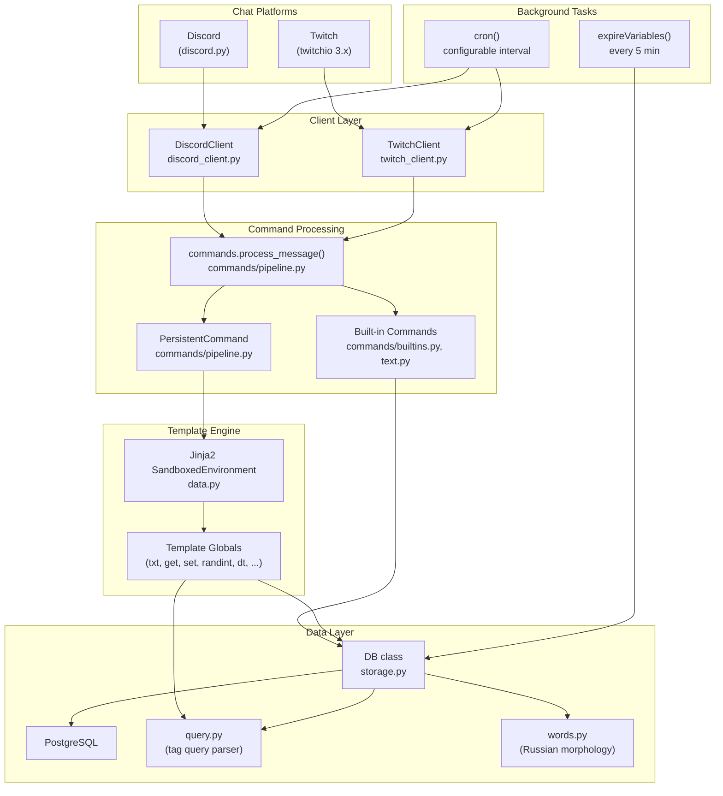
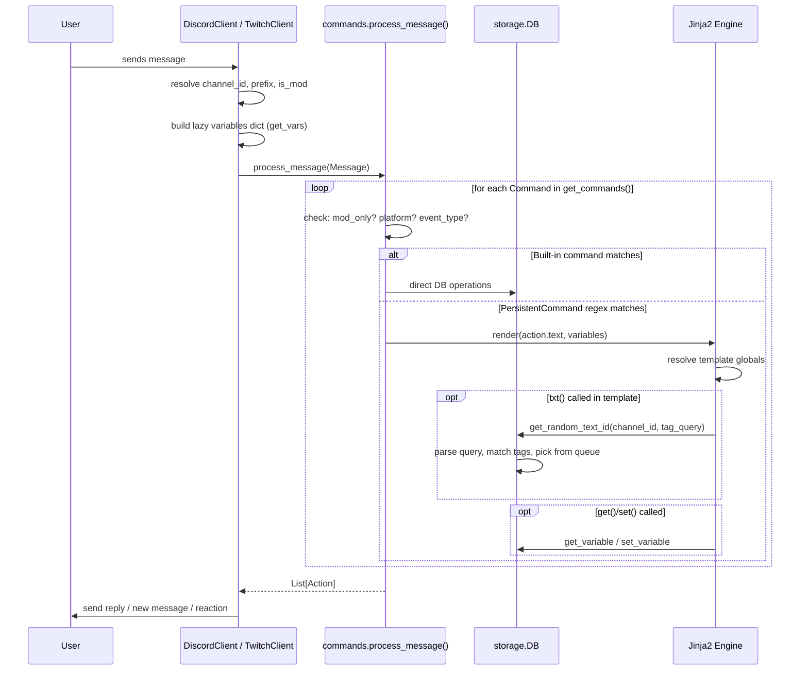
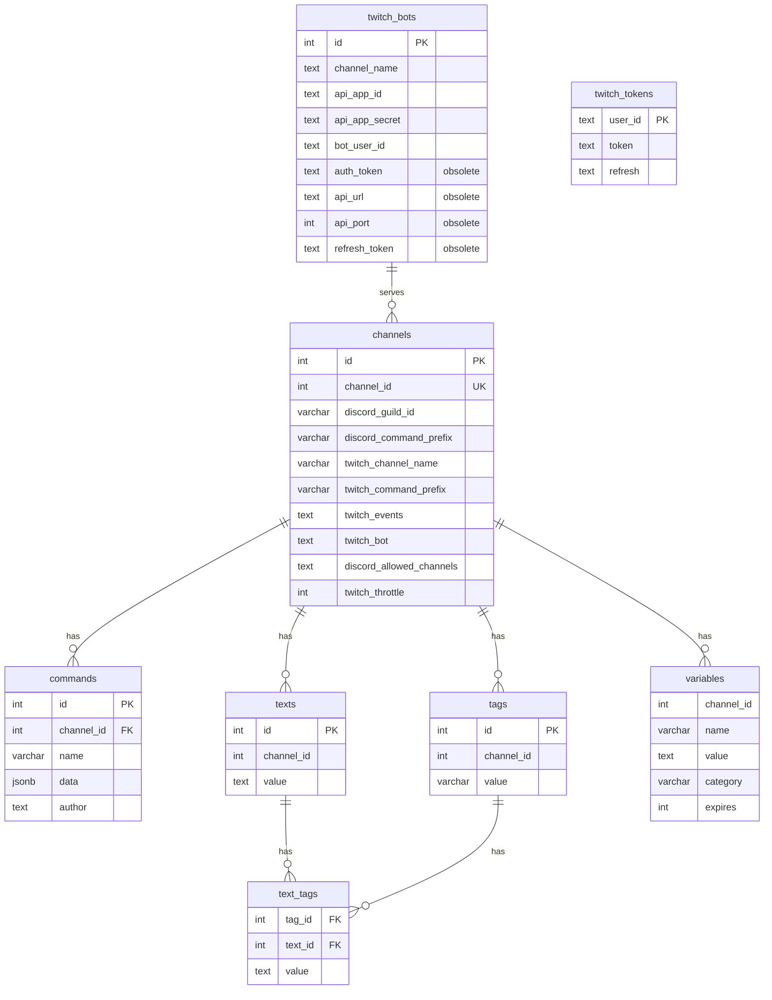

# Architecture & Data Flow

> Cross-reference: [Project Overview](overview.md) · [File Reference](file_reference.md)

---

## Component Diagram



---

## Request Lifecycle (Message)



---

## Database Schema



### Key Constraints

| Constraint | Table | Columns |
|---|---|---|
| `uniq_name_in_channel` | `commands` | `(channel_id, name)` |
| `uniq_tag_value` | `tags` | `(channel_id, value)` |
| `uniq_text_tag` | `text_tags` | `(tag_id, text_id)` |
| `uniq_text_value` | `texts` | `(channel_id, value)` |
| `uniq_variable` | `variables` | `(channel_id, name, category)` |

### Foreign Keys

- `text_tags.tag_id` → `tags.id` (ON DELETE CASCADE)
- `text_tags.text_id` → `texts.id` (ON DELETE CASCADE)

---

## In-Memory Caching (storage.py)

The `DB` class maintains extensive in-memory caches per channel via `ChannelCache`:

| Cache | Data Structure | Purpose |
|---|---|---|
| `all_text_by_id` | `Dict[int, TextEntry]` | All texts for the channel, indexed by text ID |
| `all_texts_list` | `dllist` (doubly-linked list) | All texts in shuffled order, for fair random selection |
| `queries` | `Dict[int, QueryQueue]` | Active parsed tag queries, each with its own linked-list queue of matching texts |
| `active_queries` | `TTLDict` (10-day TTL) | Tracks which query strings are still in use |
| `tag_by_id` / `tag_by_value` | `Dict` | Bidirectional tag lookup |
| `commands_cache` | `TTLDict` (10-min TTL) | Parsed command lists per `(channel_id, prefix)` |

### Random Text Selection Algorithm

`get_random_text_id()` uses a **Pareto-biased selection** from per-query doubly-linked lists:

1. For each tag query, a `QueryQueue` holds a doubly-linked list of matching `TextEntry` nodes
2. A random index is chosen using `pareto(4) * queue_size % queue_size`, biasing toward the front
3. The picked text is **moved to the end** of all queues it belongs to (including the global `all_texts_list`)
4. This ensures recently-used texts are less likely to be picked again, creating a "round-robin with randomness" effect

---

## Cron System

Both Discord and Twitch clients support periodic cron tasks:

### Discord Cron (`DiscordClient.on_cron`)
- Iterates over all guilds the bot is in
- For guilds with the `BANNER` feature, generates a dynamic banner image:
  - Uses a `banner_template` variable (stored via `set()` in admin category)
  - Template output format: `image_url;;x,y,size,r,g,b,text;;...`
  - Downloads the base image, overlays text using Pillow/arial.ttf, uploads as guild banner

### Twitch Cron (`TwitchClient.on_cron`)
- For each channel with recent activity (within 30 min), sends a synthetic `_cron` message
- This triggers any persistent command whose regex matches `<prefix>_cron`
- Allows scheduled automated messages in active Twitch channels

---

## Graceful Shutdown & Loop Lifecycle

The bot implements a clean shutdown sequence to ensure all network sessions are closed and background tasks are terminated without errors (e.g., "Unclosed client session").

### Main Loop Runner (`run_loop`)
The `run_loop()` function in `main.py` wraps the event loop execution:
- Calls `loop.run_forever()` within a `try...finally` block.
- Catches `KeyboardInterrupt` (Ctrl+C) and `GracefulExit` (from aiohttp).
- Ensures the `shutdown()` sequence is called even if an unexpected error occurs.

### Shutdown Sequence (`shutdown`)
When the bot stops, the following happens:
1. **Closing Clients**: Calls `.close()` on both `DiscordClient` and `Twitch3`.
   - `Twitch3.save_tokens()` is an asynchronous method awaited by `close()` to ensure auth state is preserved.
2. **Timeout Protection**: The client closing tasks are wrapped in `asyncio.wait_for` with a 10-second timeout.
3. **Task Cancellation**: All remaining background tasks (like `cron` and `expireVariables`) are explicitly canceled and awaited to prevent "Task was destroyed but it is pending!" warnings.
4. **Loop Termination**: After all tasks are settled, the event loop is explicitly closed via `loop.close()`.

---

## Template Variables & Globals

Available in all Jinja2 templates (persistent commands & `+eval`):

### Variables (set per-invocation)

| Variable | Type | Description |
|---|---|---|
| `author` | str | Message author mention/name |
| `author_name` | str | Display name |
| `mention` | Lazy | Direct mention if present, else random active user |
| `direct_mention` | Lazy | Explicitly mentioned users |
| `random_mention` | Lazy | Random active user (re-evaluated each access) |
| `any_mention` | Lazy | Like `random_mention` but can include author |
| `media` | str | `"discord"` or `"twitch"` |
| `text` | str | Full message text |
| `is_mod` | bool | Author is a moderator |
| `prefix` | str | Current command prefix |
| `bot` | str | Bot's mention/name |
| `channel_id` | int | Internal channel ID |

### Global Functions

| Function | Signature | Description |
|---|---|---|
| `txt` | `txt(query, inflect='')` | Random text matching tag query. `query` can be a string, int (text ID), or weighted list `['q1', weight1, 'q2', weight2]`. If `inflect` is set, returns the morphological inflection instead. |
| `get` | `get(name, category='', default='')` | Get a stored variable |
| `set` | `set(name, value='', category='', expires=32400)` | Set a variable with TTL (default 9h). Empty value deletes. |
| `category_size` | `category_size(category)` | Count variables in category |
| `list_category` | `list_category(category)` | List all variables in category |
| `delete_category` | `delete_category(category)` | Delete all variables in category |
| `randint` | `randint(a=0, b=100)` | Random integer in [a, b] |
| `timestamp` | `timestamp()` | Current Unix timestamp |
| `dt` | `dt(discord_text, twitch_text)` | Return different text per platform |
| `discord_name` | `discord_name(text)` | Normalize Discord mentions |
| `message` | `message(text)` | Queue an additional message to send |

---

## Tag Query Grammar

Defined in [query.py](file:///home/gem/src/moon-rabbit/query.py) using Lark:

```
?start: and -> start
?and: or | and "&" or | and "and" or
?or: atom | or "|" atom | or "," atom | or "or" atom
?atom: NAME | "(" and ")" | "not" atom -> not
NAME: /(\w|[-.,])+/
```

**Examples:**
- `"noun"` — texts tagged with "noun"
- `"adj and good"` — texts tagged with both "adj" and "good"
- `"cat or dog"` — texts tagged with either
- `"noun and not bad"` — tagged "noun" but not "bad"
- `"(a or b) and c"` — parenthesized grouping

Tag names are resolved to integer IDs at parse time. The parsed tree is cached and reused.

---

## Russian Morphology System

The bot has special support for Russian language morphological inflection via `pymorphy3`:

### How it works
1. Texts can be tagged with `morph` and morphological feature tags (e.g. `_NOUN`, `_masc`, `_anim`)
2. When `txt(query, 'рд')` is called with an inflection parameter, the system returns the text inflected to the requested grammatical case
3. The `TextNew`/`TextSetNew` commands auto-analyze new texts and generate morph tags

### Supported Cases (`case_tags` from words.py)
`рд` (genitive), `дт` (dative), `вн` (accusative), `тв` (instrumental), `пр` (prepositional), `мн` (plural), and plural versions of each case.
